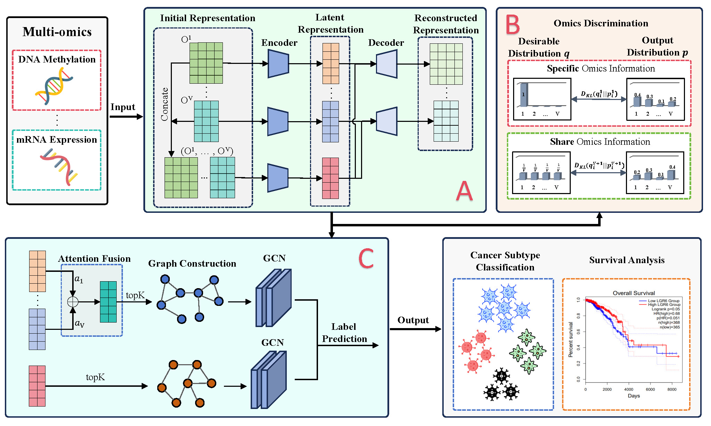

This is the code for "Advancing multi-omics analysis via dynamic labeling with shared-specific information" published in Information Sciences 2026.



```
@article{wu2026advancing,
  title={Advancing multi-omics analysis via dynamic labeling with shared-specific information},
  author={Wu, Jiecheng and Chen, Zhaoliang and Pu, Yali and Lin, Weihong and Dai, Yuanfei and Liu, Genggeng and Wu, Wenjie and Wang, Shiping},
  journal={Information Sciences},
  pages={123935},
  year={2026},
  publisher={Elsevier}
}
```